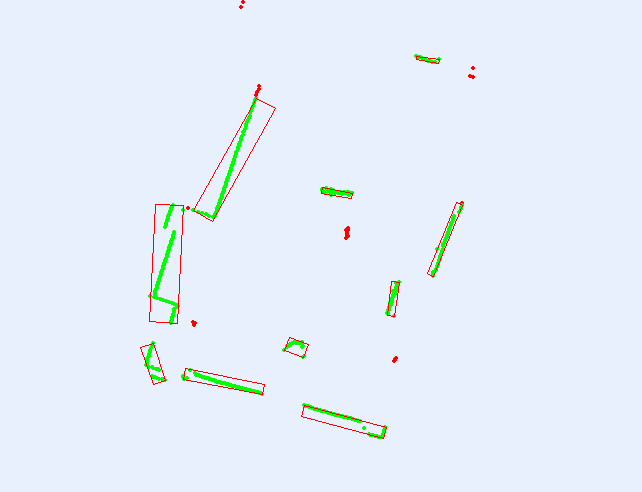
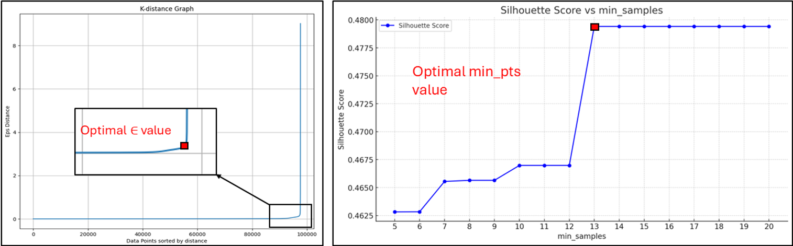
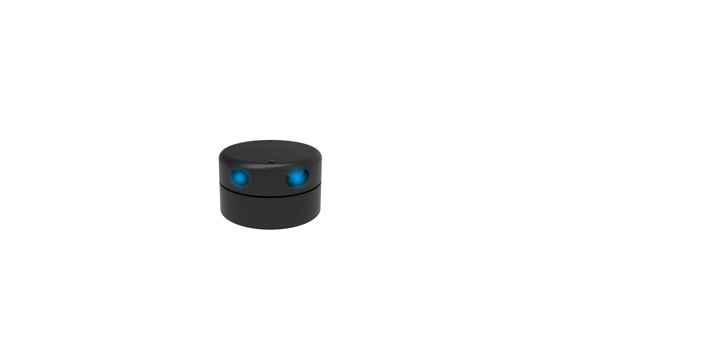
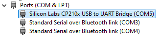

# Real-Time DBSCAN on YDLidar G2

Real-time visualization and clustering of data from the YDLidar G2 using the DBSCAN (Density-Based Spatial Clustering of Applications with Noise) algorithm.. The visualization is implemented with `pygame`, while the data processing and clustering are handled using `numpy` and `scikit-learn`. By clustering objects around with lidar, we can develop further algorithms to control robots in the environment.

Two critical values for [DBSCAN](https://scikit-learn.org/stable/modules/generated/sklearn.cluster.DBSCAN.html) to work well. Epsilon (eps) is the maximum distance between two points for them to be considered as in the same neighborhood. min_samples is the minimum number of points required to form a dense region (i.e., a cluster). To optimize them we generate the K-distance graph and silhouette score.

## YDLidar G2 Overview

The YDLidar G2 is a 2D triangular lidar sensor with the following features:
- **Frequency**: Operates between 5-12 Hz
- **Range**: Up to 16 meters
- For more information [YDLidar G2 product page](https://www.ydlidar.com/products/view/1.html)

Before getting started, make sure to review the following resources:
- [YDLidar SDK](https://www.ydlidar.com/service_support.html): Includes the SDK, LiDAR viewer, and USB driver.
- [How to Build and Run SDK](https://github.com/YDLIDAR/YDLidar-SDK/blob/master/doc/howto/how_to_build_and_install.md): Step-by-step guide to building the SDK.
- [User Manual](https://github.com/YDLIDAR/YDLidar-SDK/blob/master/doc/howto/how_to_build_and_install.md): Detailed user guide.

## Prerequisites

To use this project with Python, you will need the following tools:
- [vcpkg](https://github.com/microsoft/vcpkg): to manage C++ libraries.
- [CMake](https://cmake.org/): to control the software compilation process.
- [SWIG](http://www.swig.org/): to connect C/C++ code with various high-level programming languages.
- Visual Studio is recommended by manufacturer. But I used VS Code, no problem.

## Installation and Setup

- Step 1: Build the YDLidar SDK and Python API
- Follow the instructions in the [YDLidar SDK repository](https://github.com/YDLIDAR/YDLidar-SDK) to build the C++ library using CMake and generate the Python bindings using SWIG.
- Step 2: Install the USB Driver
- Download and install USB adapter board driver from the [YDLidar service support page](https://www.ydlidar.com/service_support.html). After installation, verify the device in the Device Manager.

- Step 3: Set Up a Python Virtual Environment to avoid compatibility issues

TODO:
- Improve plotting, add data assosiation
- Extend it to all lidars for YD Lidar by implementing lidar setup class
- Enable choice either detect standing objects or not detect them.

